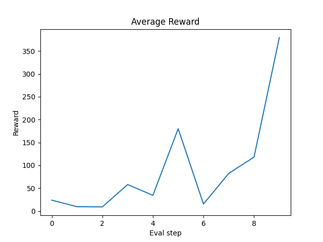
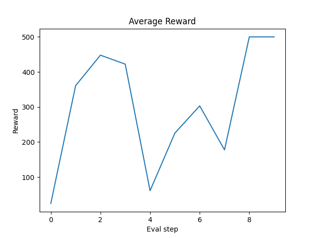
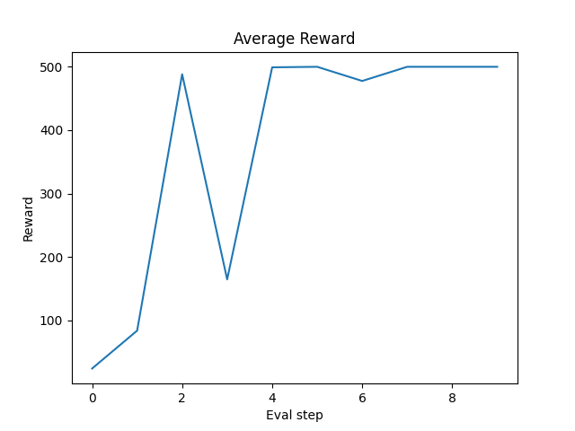
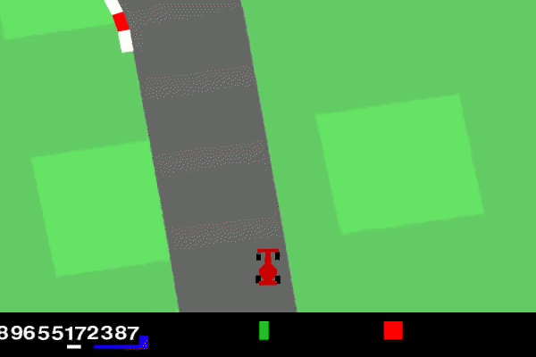
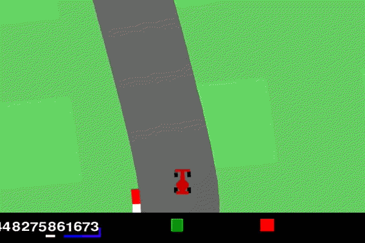

# Homework03: Getting Up to Speed with Deep Reinforcement Learning

This folder contains the files for the third laboaratory which focuses on reinforcement learning.

## Main Files

### `Excercises_1_2.py`

Python file containing the code for the first two excercises.

### `agent.py`

Python file containing the PPO agent used to solve excercise 3.

### `car_race.py`

Python file that define the functions to instatiate a Gymnasium CarRacing enviroment.

### `ppo.py`

Python file implementing PPO algorithm.

### `test_agent.py`

Script that evalautes the performance of the PPO agent after training.

## Dependencies

Project dependencies are managed using **uv**.

Install the required packages with:

```bash
uv sync
```
## How to Use

### Exercises 1 & 2: REINFORCE and Baseline REINFORCE

The script supports both the standard **REINFORCE** algorithm and a **Baseline REINFORCE** variant through command-line arguments.

#### Training a REINFORCE Agent

```bash
python Excercises_1_2.py --algo reinforce
```

#### Training a Baseline REINFORCE Agent

```bash
python Excercises_1_2.py --algo baseline
```

#### Example with Custom Hyperparameters

```bash
python Excercises_1_2.py \
    --algo reinforce \
    --num_episodes 2000 \
    --gamma 0.99 \
    --std \
    --folder results
```

### Exercise 3: PPO on CarRacing


#### Training a PPO Agent

Run the training script with default parameters:

```bash
python ppo.py
```

#### Example with Custom Parameters

```bash
python ppo.py \
    --total-timesteps 5000000 \
    --num-envs 8 \
    --learning-rate 2.5e-4
```

#### Resuming Training from a Checkpoint

```bash
python ppo.py \
    --resume checkpoints/<experiment_name>/checkpoint.pt
```

During training, checkpoints are automatically saved in the `checkpoints/` directory.

The best-performing model is saved as:

```text
checkpoints/<experiment_name>/best_model.pt
```

while the final model is saved as:

```text
checkpoints/<experiment_name>/final_model.pt
```

### Evaluating a Trained PPO Agent

The script `test_agent.py` can be used to evaluate a trained PPO agent.

#### Basic Evaluation

```bash
python test_agent.py \
    --model-path checkpoints/<experiment_name>/best_model.pt
```

After evaluation, the script reports:

- Average return
- Standard deviation of returns
- Minimum return
- Maximum return
- Success rate (episodes with return > 900)

The evaluation metrics are also saved in the `agents_performances/` directory.

## Results
### Exercises 1 & 2: REINFORCE and Baseline REINFORCE
In exrcesise 1 and 2 I refactored the implementation of the reinforce algorithm and implemented a version that uses a network with the same architecture as a baseline. The training parameters used are:

- optimizer: Adam
- lr: 1e-2
- num_episodes: 1000
- evaluate every 100 episodes
- 20 episode for evaluation
- gamma: 0.99

The figure below shows the average reward obtained during training using the REINFORCE algorithm without reward standardization.



The final average reward over 10 episodes was 116.3.

The figure below shows the average reward obtained during training using the REINFORCE algorithm with reward standardization.



The final average reward over 10 episodes was 500.

The figure below shows the average reward obtained during training using the REINFORCE algorithm with reward standardization.



The final average reward over 10 episodes was 500.

Without standardization the agent doesn converge to the maximum reward. The agent trained with the baseline approach converges earlier than the one that only standardizes the returns.

### Exercises 3: PPO on CarRacing

To implement the code for ppo i used this sites and repository as a reference:  
https://iclr-blog-track.github.io/2022/03/25/  ppo-implementation-details/
https://github.com/vwxyzjn/ppo-implementation-details/tree/main  
https://notanymike.github.io/Solving-CarRacing/

I refactored the code from the repository to better understand PPO, I implemented checkpointing and changed how the metrics were saved.

The best training parameters i found  are the following:  
- optimizer: Adam
- lr: 2.5e-4 with annealing
- total timesteps: 5M
- num envs: 8
- steps per env during policy rollout: 1024
- gamma: 0.99
- gae gamma: 0.95
- update epochs: 4
- surrogate clipping loss coefficient: 0.1
- entropy loss coefficient: 0.01
- value function loss coefficient: 0.5
- maximum norm for the gradient clipping: 0.5
- target KL divergence threshold: 0.15
- positive reards clipped at: 0.8

The enviroment is considered solved if the average episodic return over 100 episodes is > 900

The results I obtained are the following:
- average return: 888.79
- Std return: 38.44
- Min return: 705.46
- Max return: 924.20
- Success rate (>900): 52.00%

This is a video of the best agent playng:  


This is a video of an agent trained without reward clipping:  


With reward clipping, the car is less incentivized to drive fast, allowing it to make sharper turns.

## Information about the use of AI
I used LLM to develop this laboratory. In particular I used AI to help me code, debug and improve the models performance. I checked the results by looking at the documentation and trying the code in a notebook.
Here are some chat transcripts:  
https://chatgpt.com/share/6a3c11de-29ec-83eb-ab84-859fca4d0a01  
https://chatgpt.com/share/6a3c0fcc-0828-83eb-b868-601238b719a5
